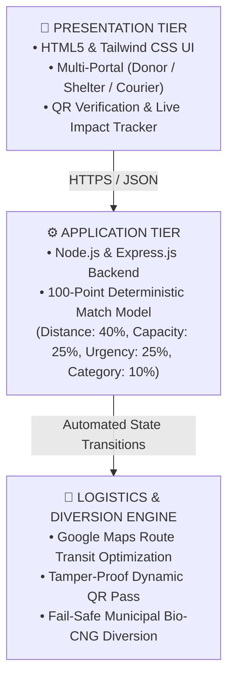

# 🍲 SurplusToShelter
> Real-time food rescue routing engine connecting surplus kitchens to shelters with QR verification and bio-recycle diversion.

## 🚀 Live Demo
- **Platform URL:**https://violet-angel-83.tiiny.site

## 📌 Problem Statement
Cooked commercial surplus food spoils within a narrow 2-6 hour window. Manual communication groups fail to balance distance, capacity, and temperature conditions, causing zero custody verification and high landfill emissions.

## 💡 System Architecture

## ✨ Core Features
- **Deterministic Matching Engine:** Real-time multi-factor scoring ensuring optimal shelter assignments.
- **Dynamic QR Handover:** Dynamic cryptographic pass generation for physical chain-of-custody verification.
- **Fail-Safe Bio-CNG Diversion:** Redirects batches exceeding safe consumption limits into municipal bio-energy units.
- **Live Environmental Impact:** Automated calculation of rescued meals, diverted landfill weight, and avoided CO2e.

## 🛠️ Tech Stack
- **Frontend:** Semantic HTML5, Tailwind CSS, JavaScript (ES6+)
- **Backend:** Node.js, Express.js
- **Libraries & APIs:** QRCode.js, Google Maps Direction API
- **Deployment:** Tiiny Host, GitHub
